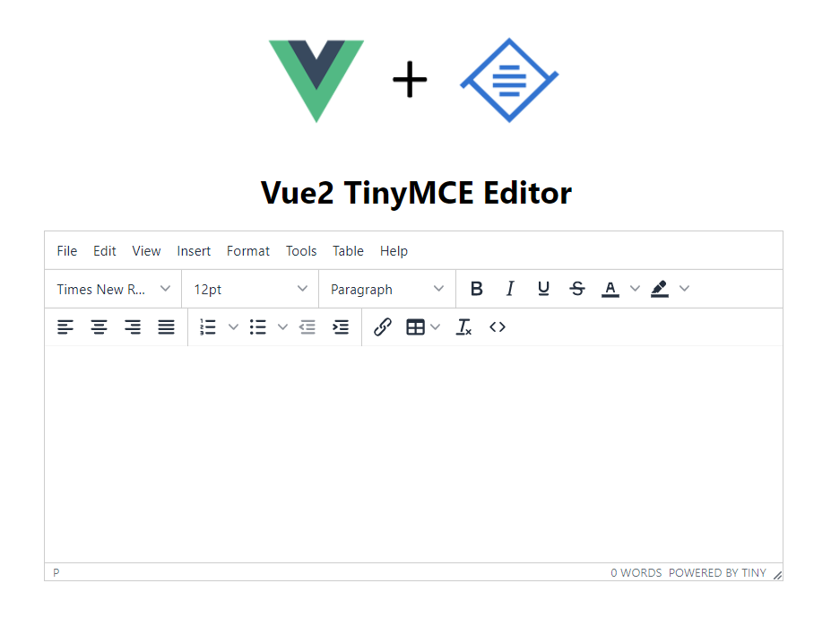

# Vue2-TinyMCE-Editor

> A TinyMCE WYSIWYG editor component for your Vue products




This project is an upgrade version of [vue-tinymce-editor](https://github.com/dyonir/vue-tinymce-editor).
 
I updated version to vue(2.6.11) and tinymce(5.6.2) and added new features.  
 
## Install

_You can use Yarn or NPM_

```bash
npm install vue2-tinymce-editor
```

**OR**

```bash
yarn add vue2-tinymce-editor
```

## Usage

```vue
<template>
  <div id="app">
    <vue2-tinymce-editor v-model="content"></vue2-tinymce-editor>
  </div>
</template>

<script>
import { Vue2TinymceEditor } from "vue2-tinymce-editor";

export default {
  components: {
    Vue2TinymceEditor
  },

  data() {
    return {
      content: "<h1>Some initial content</h1>"
    };
  }
};

```

## Props

| Name                  | Type      | Default           | Description                                                   |
| --------------------- | --------- | ----------------- | ------------------------------------------------------------- |
| id                    | String    | -                 | Editor container id                                           |
| v-model               | String    | -                 | The content or data property you wish to bind with it         |
| width                 | Numeric   | auto              | Width of the editor container                                 |
| height                | Numeric   | 300px             | Height of the editor container                                |
| options               | Object    | -                 | Configure object for advanced use                             |                                                 | Set v-model to the the content or data property you wish to bind it to                 |

## Events

| Name                  | Parameters                   | Description                                                                         |
| --------------------- | ---------------------------- | ---------------------------------------------------------------|
| editorChange          | Event                        | Emitted on TinyMCE's `onchange` event                          |
| editorInit            | Event                        | Emitted when editor is initialized                             |


## Advanced Usage 

```vue
<template>
    <div id="app">
        <vue2-tinymce-editor :id="your-id" v-model="content" :width:="500" :height="300" :options="options"></vue2-tinymce-editor>
    </div>
</template>

<script>
import { Vue2TinymceEditor } from "vue2-tinymce-editor";

export default {
    components: {
        Vue2TinymceEditor
    },

    data() {
        return {
            content: "<h1>Some initial content</h1>",
            options:{
                    menubar:false,
                    plugins: 'advlist autolink charmap code codesample directionality emoticons',
                    toolbar1:'fontselect | fontsizeselect | formatselect | bold italic underline strikethrough forecolor backcolor',
                    toolbar2:'alignleft aligncenter alignright alignjustify | numlist bullist outdent indent | link table removeformat code',
                    ......
                    // any other tinymce options
                  }
            };
    }
};

```

## TinyMCE

### Supported Plugins 
- Advanced List
- Anchor
- Autolink
- Autoresize
- Autosave
- BBCode
- Character Map
- Code
- Code Sample
- Directionality
- Emoticons
- Full Page
- Full Screen
- Help
- Horizontal Rule
- Image
- Image Tools
- Import CSS
- Insert Date/Time
- Legacy Output
- Link
- Lists
- Media
- Nonbreaking Space
- Noneditable
- Page Break
- Paste
- Preview
- Print
- Quick Toolbars
- Save
- Search and Replace
- Spell Checker
- Tab Focus
- Table
- Template
- Text Pattern
- Table of Contents
- Visual Blocks
- Visual Characters
- Word Count

## Access to the editor
You can access the editor by add a ref:
```vue
<vue2-tinymce-editor id="d1" v-model="data" ref="te"></vue2-tinymce-editor>
```
Then access the editor like this:
```vue
this.$refs.te.editor
```

## License

MIT
